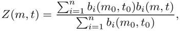

### Metrics and automated curation

The raw output of MoutainSort are a number of clusters span a range of isolation qualities, and must be  stratified so that only sufficiently isolated clusters can be selected for  downstream analysis. MountainSort's strategy here is to do a quality assessment based upon metrics and thresholds, resulting in categorization of the clusters into multiple groups.

Such decisions have traditionally been handled via  case-by-case curation by manual operators. In contrast, our strategy only  requires the operator to set thresholds on cluster quality metrics, as defined  below. These metrics can be adjusted based on the type of analysis that will be  done. Furthermore, the metrics can also be exported alongside the event times  and labels allowing analyses sensitive to unit isolation and noise contamination  to be repeated with different thresholds or weighting criteria.

### Isolation

The isolation metric quantifies how  well separated (in feature space) the cluster is from other nearby clusters.  Clusters that are not well separated from others would be expected to have high  false positive and false negative rates due to mixing with overlapping  clusters. This quantity is calculated in a nonparametric way based on  nearest-neighbor classification.

Let A and B be two distinct  clusters. For each x in A∪B, let n1(x),  … , nk(x)  be the k nearest neighbors of x in A∪B. Let ρ be the membership function so that ρ(A) = 1 and ρ(B) = 2. Then we define the k-nearest neighbor overlap between A and B to be

which is the fraction  of the nearest neighbors that are classified consistently with their parent  point. The isolation metric is then calculated as

Often, the number of points in one cluster will be much larger than in the  other. This can lead to an artificially high overlap metric because the likelihood  of misclassification depends not only on the degree of separation but also on  the relative sizes of the clusters. Therefore we only sample N random points  from each of the two clusters where N is the minimum size of the two clusters.  To reduce computation time we also require that N is at most 500.

### Noise overlap

Noise overlap estimates  the fraction of “noise events” in a cluster, i.e., above-threshold events not  associated with true firings of this or any of the other clustered units. A  large noise overlap implies a high false positive rate. The procedure first  empirically computes the expected waveform shape for noise events that have by  chance crossed the detection threshold. It assesses the extent of feature space  overlap between the cluster and a set of randomly selected noise clips after  correcting for this expected noise waveform shape.

We would like to define the noise overlap of cluster A to be the overlap metric for A with a “fake” cluster comprised of the same number of random noise events (clips extracted  from the original data at purely random times). However, the difficulty in  comparing these two clusters is that the event clips of A have a bias in  that they were selected for being (perhaps by chance) super-threshold.  Therefore, we need to first remove this bias by subtracting out a multiple of  the expected noise waveform Z to  obtain adjusted clips prior to computing the overlap. We use the following  weighted average for the expected noise waveform:

where the weight bi(m0,  t0) is the value of the spike at its central channel and central  time sample. We then define the noise overlap to be the overlap metric applied  to the sets of event clips after projecting out the dimension defined by the  expected noise shape:

*m*noise(A) = *m*overlap(Ã,B̃)

The noise overlap and isolation metrics are always between 0 and 1 and in a sense represent the fraction of points that overlap either with another cluster (isolation metric) or with the noise cluster (noise overlap metric). However, they should not be interpreted as an estimate of the misclassification rate, although we expect it to be predictive of this quantity. Indeed, due to the way they are computed, these values will depend on factors such as the dimensionality of the feature space and the noise properties of the underlying data. Therefore the annotation thresholds should be chosen to suit the application.

### Cluster SNR

Depending on the nature of signal contamination in the dataset, some clusters may consist primarily of artifactual signals. In this case, the variation among event voltage clips will be large compared with clusters that correspond to neural units. To automatically exclude such clusters we compute cluster SNR, defined as the peak absolute amplitude of the average waveform divided by the peak standard deviation. The latter is defined as the standard deviation of the aligned clips in the cluster, taken at the channel and time sample where this quantity is largest.

Other metrics. Other metrics such as firing rate and peak amplitude can also be used to stratify clusters.

### Automated curation
 
Curation is done using a javascript file, the curation.script, but will be integrated into the main clustering pipeline at a future date.

Currently, the curation.script should be placed in the same location as the datasets.txt and pipelines.txt and can be added to the pipelines.txt with flag 
> --curation=curation.script
for example, the pipelines.txt could read:
> ms_multi mountainsort_002_multisession.pipeline --curation=curation.script --sessions=1 --sessions=2

An example curation.script is found in the MountainSort Repository in examples/003_kron_mountainsort/curation.script
